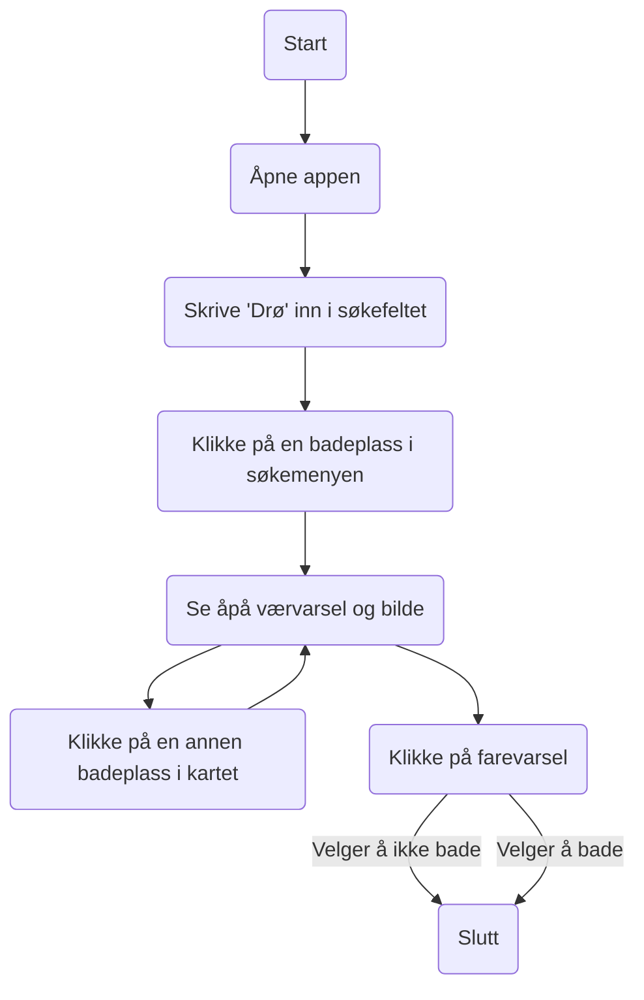

```mermaid
flowchart TD
%% Nodes
    A(Start)
    B(Åpne appen)
    C(Skrive 'Drø' inn i søkefeltet)
    D(Klikke på en badeplass i søkemenyen)
    E(Se åpå værvarsel og bilde)
    F(Klikke på en annen badeplass i kartet)
    G(Klikke på farevarsel)
    H(Slutt)

%% Edge connections between nodes
    A --> B --> C --> D --> E 
    E --> F --> E
    E --> G
    G -- Velger å ikke bade --> H
    G -- Velger å bade --> H
```
