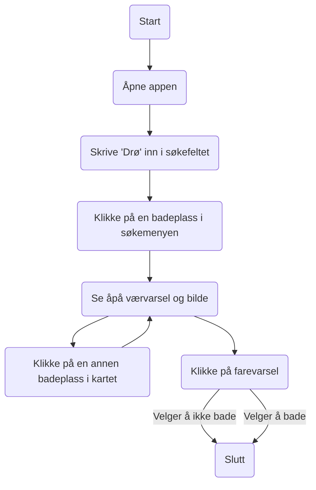

# Modellering av funksjonalitet i PLASK
Dette dokumentet tar for seg noe av hovedfunksjonaliteten i appen PLASK.

## Funksjonelle krav
Utgangspunktet for denne modelleringen er noen av de viktigste funksjonelle kravene til appen. Disse kravene er utviklet fra de viktigste brukerhistoriene som ble identifisert under tidlig datainnsamling, og har dannet kjernen av funksjonalitet for appen. Disse kravene er ikke sortert etter noen prioritering, men har dannet utgangspunktet for to Use caser som dekker hovedfunksjonaliteten til appen.

### Viktigste funksjonelle krav
- Appen skal vise et kart over badeplasser i Norge.
- Brukeren skal kunne se aktive farevarsler for badeplassene.
- En badeplass sitt farenivå skal representeres med farge i Markøren i kartet
- Brukeren skal kunne se temperatur i vannet, bølgehøyde og -retning ved en badeplass.
- Brukeren skal kunne se været ved badeplassen nå.
- Brukeren skal kunne lagre favorittbadeplassene sine.
- Brukeren skal kunne se bilde av badeplassene
- Det skal være mulig å søke etter badeplasser både på navn, sted og område.

### Use case 
Fra kravene identifisert over, har vi identifisert to Use-caser som dekker flere av hovedfunksjonene i appen.

### Use case-diagram

### Sekvensdiagram

### Klassediagram

## Use-case 1 - Finne badeplass i Drøbak
Dette use-caset bekriver en bruker som er på dagstur til Drøbak, og ønsker å finne den badeplassen i Drøbak som frister mest å bade ved.

**Navn**: Finn badeplass i Drøbak
**Aktør**: Bruker
**Prebetingelser**: Internettilkobling
**Postbetingelser**: *Ingen*

### Hovedflyt
1. Åpne appen
2. Skrive "Drø" inn i søkefeltet
3. Klikke på "Badeparken i Drøbak"
4. Se på værvarsel og bilde
5. Klikke på en annen badeplass i nærheten
6. Se på værvarsel og bilde

### Alternativ flyt
4.1 Det er et farevarsel for Badeparken i Drøbak
4.2 Klikker på farvarselsymbolet
4.3 Ser at farlige værfohold gjør det lite attraktivt å bade. Velger å ikke bade i Drøbak på denne dagsturen

## Use-case 2 - Lagre Huk som favoritt
Dette use-caset beskriver en bruker som elsker å bade ved Huk-badeplass, og derfor ønsker å lagre Huk som favoritt.

**Navn**: Lagre Huk som favoritt
**Aktør**: Bruker
**Prebetingelser**: Internettilkobling
**Postbetingelser**: Huk er lagt til i listen over favorittbadeplasser

### Hovedflyt

 1. Åpne appen
 2. Navigere til Huk i kartet
 3. Klikke på *Markøren* til Huk badeplass
 4. Klikke på *stjernen* ved siden av navnet til badeplassen
 5. Klikke på *Favoritter* i navigasjonsmenyen
 6. Ser at Huk er sagret som favoritt

## Use case-diagram (Use case 1)

