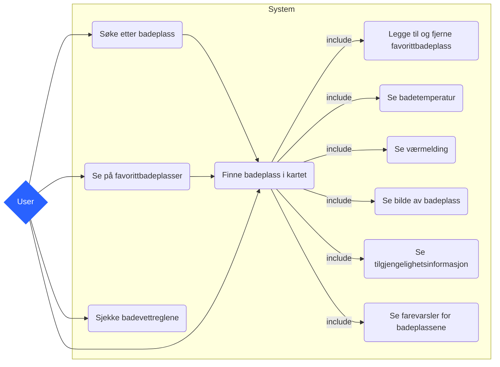
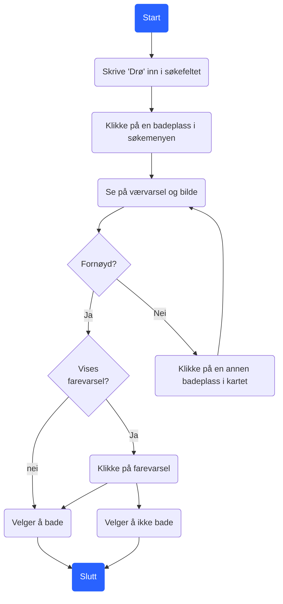
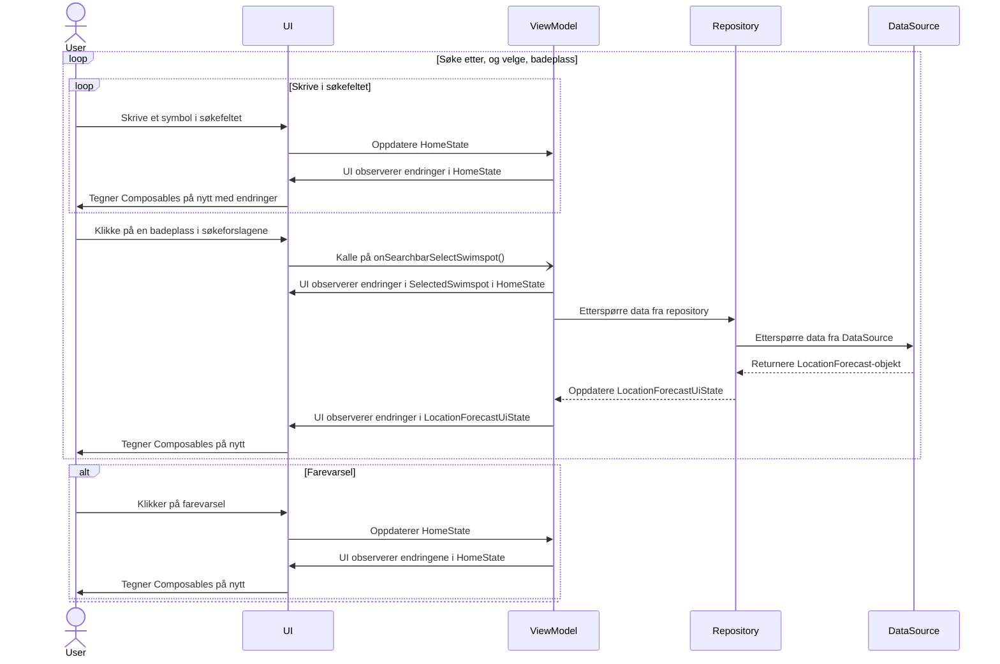
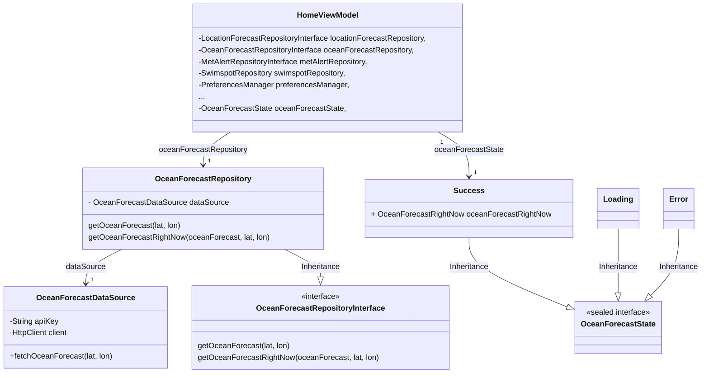
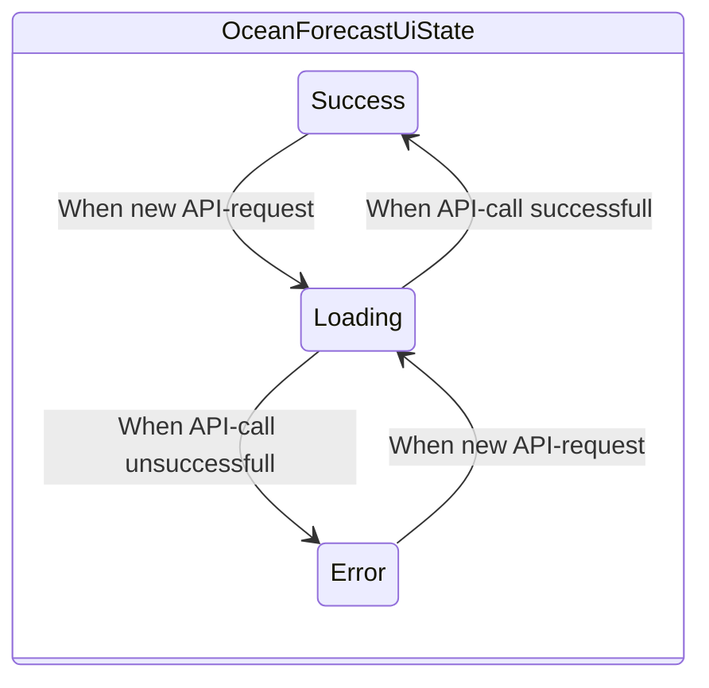
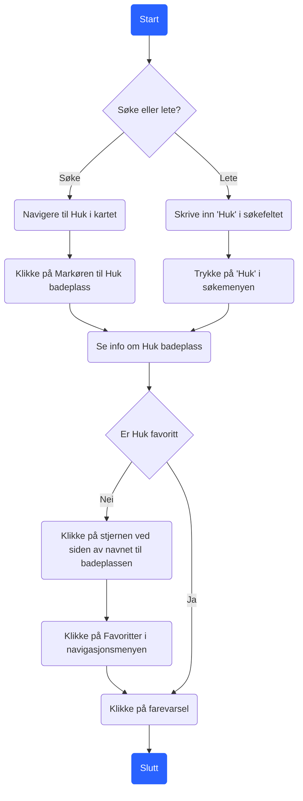
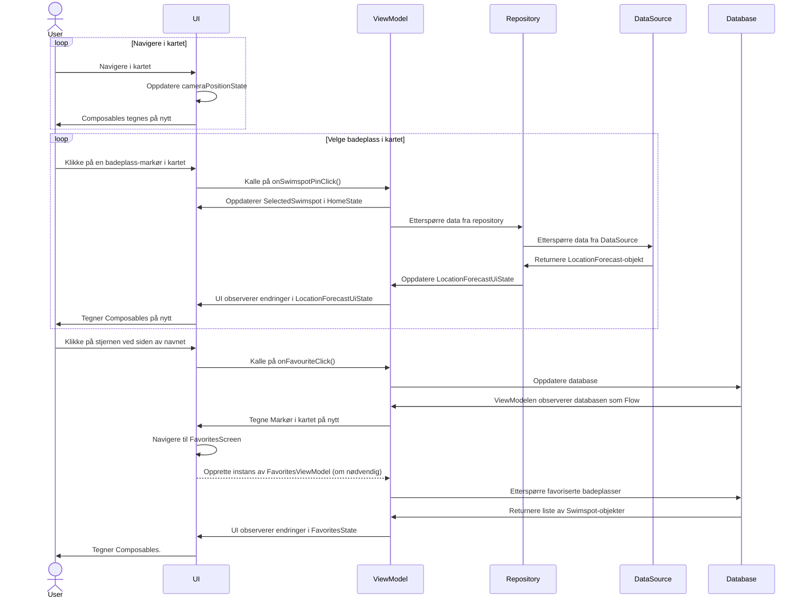

# Modellering av funksjonalitet i PLASK
Dette dokumentet tar for seg noe av hovedfunksjonaliteten i appen PLASK. Noen av modellene avviker litt i notasjon fra Unified Modeling Language (UML), ettersom vi har valgt å følge oppgavetekstens anbefaling og bruke Mermaid for modellering. Alle avvik fra UML er oppgitt under.

## Funksjonelle krav
Utgangspunktet for denne modelleringen er noen av de viktigste funksjonelle kravene til appen. Disse kravene er utviklet fra de viktigste brukerhistoriene som ble identifisert under tidlig datainnsamling, og har dannet kjernen av funksjonalitet for appen. Disse kravene er ikke sortert etter noen prioritering, men har dannet utgangspunktet for to Use caser som dekker hovedfunksjonaliteten til appen.

### Viktigste funksjonelle krav
- Appen skal vise et kart over badeplasser i Norge.
- Brukeren skal kunne se aktive farevarsler for badeplassene.
- En badeplass sitt farenivå skal representeres med farge i Markøren i kartet
- Brukeren skal kunne se temperatur i vannet, bølgehøyde og -retning ved en badeplass.
- Brukeren skal kunne se været ved badeplassen nå.
- Brukeren skal kunne lagre favorittbadeplassene sine.
- Brukeren skal kunne se bilde av badeplassene
- Det skal være mulig å søke etter badeplasser både på navn, sted og område.

### Use case-diagram
De funksjonelle kravene over har gitt opphav til use case-diagrammet under. Her representerer vi ulike user-stories og hvordan de henger sammen, slik som brukeren opplever appen.

### Use case 
Fra kravene identifisert over, har vi identifisert to Use-caser som dekker flere av hovedfunksjonene i appen. Disse er først beskrevet med en tekstlig beskrivelse.
Diagrammet avviker fra UML ved at noden "User" ikke ser ut som en strekfigur, og at includes- og extends-relasjojnene ikke er notert med "<<" og ">>".

### Aktivitetsdiagram
Deretter er use casene videre modellert i et aktivitetsdiagram som viser hvordan brukeren jobber seg gjennom den aktuelle funksjonaliteten. Dette viser i stor grad hvordan brukeren opplever appen.

Diagrammet avviker fra UML ved at noden User ikke ser ut som en strekfigur, og at includes- og extends-relasjojnene ikke er notert med 

### Sekvensdiagram
Hver av use-casene er videre modellert med et sekvensdiagram, som viser i større detalj hvordan dataflyten foregår.

### Klassediagram

## Use case-diagram
Dette diagrammet viser ulike use caser i appen. 

# Use-case 1 - Finne badeplass i Drøbak
Dette use-caset bekriver en bruker som er på dagstur til Drøbak, og ønsker å finne den badeplassen i Drøbak som frister mest å bade ved.

**Navn**: Finn badeplass i Drøbak
**Aktør**: Bruker
**Prebetingelser**: Internettilkobling
**Postbetingelser**: Brukeren skal ha bestemt seg for hvor å bade på dagstur i Drøbak.

### Hovedflyt
1. Åpne appen
2. Skrive "Drø" inn i søkefeltet
3. Klikke på "Badeparken i Drøbak"
4. Se på værvarsel og bilde
5. Bestemmer seg for å bade eller å ikke bade ved en badeplass

### Alternativ flyt 1 (Kan repeteres)
4.1 Se på værvarsel og bilde

4.2 Er ikke fornøy og navigerer til en ny badeplass

### Alternativ flyt 2
4.1 Det er et farevarsel for badeplassen

4.2 Klikker på farvarselsymbolet

4.3 Ser at værforholdene kan gjøre det ugunstig å bade.

## Aktivitetsdiagram

## Sekvensdiagram

Dette sekvensdiagrammet beskriver samhandlingen mellom Bruker, UI og ViewModel, samt hvordan ViewModel henter data fra Repository og DataSource. I sekvensdiagrammet er det ikke spesifisert både LocationForecast og OceanForecast som Repository og DataSource, ettersom begge disse er implementert relativt likt. Sekvensdiagrammet inkluderer ikke prosesser som skjer ved oppstart av appen, som f.eks. kall på MetAlertRepository og -DataSource, men har som forutsetning at dette allerede er oppdatert i HomeState.

## Klassediagram

Dette klassediagrammet beskriver forholdet mellom klassene som brukes til å hente data fra API-ene fra Meterologisk institutt.
- **Hvit pil** peker på interfacet/klassen en klasse arver fra, og er markert med "inheritance".
- **Sort pil** peker på klassen som en variabel er en instanse av. Pilen er markert med hvilken variabel det er snakk om.

## Tilstandsdiagram

Følgende tilstandsdiagram viser hvordan tilstanden til OceanForecastUiState endrer seg over tid. 

# Use-case 2 - Lagre Huk som favoritt
Dette use-caset beskriver en bruker som elsker å bade ved Huk-badeplass, og derfor ønsker å lagre Huk som favoritt.

**Navn**: Lagre Huk som favoritt
**Aktør**: Bruker
**Prebetingelser**: Internettilkobling
**Postbetingelser**: Huk er lagt til i listen over favorittbadeplasser

### Hovedflyt

 1. Åpne appen
 2. Navigere til Huk i kartet
 3. Klikke på *Markøren* til Huk badeplass
 4. Klikke på *stjernen* ved siden av navnet til badeplassen
 5. Klikke på *Favoritter* i navigasjonsmenyen
 6. Ser at Huk er sagret som favoritt

### Alternativ flyt 1
2.1 Skriver "Huk" i søkefeltet
2.2 Klikker på Huk i søkemenyen.

### Alternativ flyt 2
4.1 Huk er allerede markert med stjerne

## Aktivitetsdiagram

## Sekvensdiagram

På samme måte som tidligere, beskriver dette sekvensdiagrammet samhandlingen mellom Bruker, UI og ViewModel. I tillegg vises hvordan ViewModel henter data fra Repository, DataSource og Database. Implementasjonen av databasen er i dette diagrammet abstrahert bort, men i hovedsak kommuniserer ViewModel med et repository, som igjen kommuniserer med et DataAccessObject (DAO), som kommuniserer med databasen.

